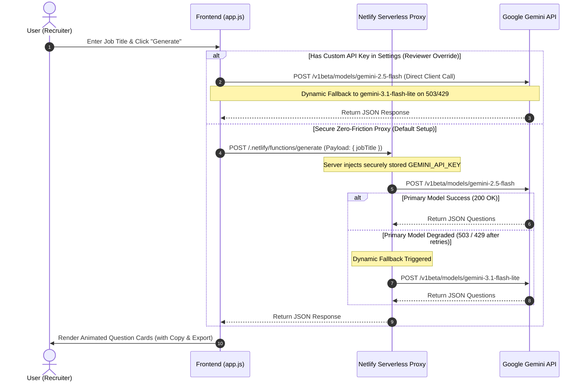

# IQ Gen — AI Interview Question Generator

AI-powered interview question generator that creates thoughtful, role-specific questions for any job title. Built with vanilla HTML, CSS, and JavaScript — no frameworks, no build tools, instant deploy. 

---

## 🏗️ System Architecture & Workflow

IQ Gen is designed with a **highly secure, serverless proxy architecture** that separates client presentation from the AI ingestion backend. This ensures the application is both responsive and completely secure against credential theft.

### Sequence Diagram



### Flowchart: Request Routing & Fallback System

```mermaid
graph TD
    User([User]) -->|Submits Job Title| Frontend[Vanilla HTML/JS/CSS Frontend]
    Frontend -->|Has Custom Key?| KeyDecision{Custom API Key?}
    
    %% Direct Route
    KeyDecision -->|Yes (Bypass Proxy)| DirectRoute[Client-Side Direct Call]
    DirectRoute -->|Attempt 1| DirectPrimary[gemini-2.5-flash]
    DirectPrimary -->|503 or 429| DirectFallback[gemini-3.1-flash-lite]
    DirectFallback -->|Success| Output
    DirectPrimary -->|Success| Output
    
    %% Proxy Route
    KeyDecision -->|No (Secure Proxy)| ProxyRoute[POST /.netlify/functions/generate]
    ProxyRoute --> ServerlessFn[Netlify Serverless Function]
    ServerlessFn -->|Injects Secure Key| EnvVars[(Netlify Environment Variables)]
    ServerlessFn -->|Attempt 1| PrimaryModel[gemini-2.5-flash]
    
    PrimaryModel -->|Success 200 OK| Output[Rendered Cards: Copy & Export]
    PrimaryModel -->|503 Service Unavailable / 429 Rate Limit| FallbackDecision{Model Fallback?}
    
    FallbackDecision -->|Yes| FallbackModel[gemini-3.1-flash-lite]
    FallbackModel -->|Success 200 OK| Output
    FallbackDecision -.->|Second Fallback| BackupModel[gemini-2.5-flash-lite]
    BackupModel -->|Success 200 OK| Output
```

---

## 🛠️ Tech Stack & Key Technologies

* **Frontend**: Pure HTML5, CSS3 (Vanilla design token system, responsive grids, glassmorphic UI), and ES Modules. No build tool, bundler, or heavy framework required.
* **Serverless Backend**: Hosted on **Netlify Functions** (`netlify/functions/generate.js`) to completely hide the API key from the browser.
* **LLM Engine**: **Google Gemini API** (`gemini-2.5-flash` with dynamic fallbacks to `gemini-3.1-flash-lite` and `gemini-2.5-flash-lite`).
* **Persistence & State**: `sessionStorage` for temporary, tab-isolated key overrides, and `localStorage` for theme preference caching.

---

## 🛡️ Enterprise-Grade Security & Resiliency

### 1. Zero-Friction Credential Security
* **Serverless Proxy**: By default, client-side requests are securely proxied through Netlify's CDN edge to a Serverless Function. The `GEMINI_API_KEY` is securely injected from Netlify's encrypted vault on the server side, meaning it **never traverses the network to the user's browser**.
* **Protected Repositories**: The `.gitignore` file is strictly configured to ensure local `.env` configuration files and large packages (`node_modules/`) are never pushed or leaked to public version control repositories.

### 2. Multi-Model Fallback Shield
To guarantee high availability and eliminate **503 (Service Unavailable)** or **429 (Resource Exhausted)** errors during times of intense Google backend demand, the application implements an automatic model fallback chain:
1. **`gemini-2.5-flash`** (Primary high-performance model)
2. **`gemini-3.1-flash-lite`** (Ultra-fast, high-availability frontier fallback)
3. **`gemini-2.5-flash-lite`** (Fast, highly stable backup fallback)

If a model degrades or rate-limits, the request automatically slides to the next available model in the sequence inside the same network call.

---

## ✨ Premium Features

* **Deep-Linking**: Pass a job role via the URL parameters (e.g., `?role=Customer+Success+Manager`) to instantly trigger zero-click, beautifully animated question generations on load.
* **One-Click Copy**: Custom cards equipped with visual haptic feedback (copy buttons dynamically morph to checkmarks upon successful Clipboard API interaction).
* **Export to Plaintext**: Automatically packages the role, timestamp, and generated questions into a cleanly structured `.txt` file for download.
* **Dynamic Theme Engine**: Seamless Light/Dark mode transitions respecting system preferences automatically, while keeping overrides saved locally.
* **Strict Accessibility (a11y)**: Built with native semantic tags, custom focus outlines, keyboard navigational compliance, and dynamic `aria-live` regions to announce skeleton loads to screen readers.

---

## 🚀 Getting Started (Local Development)

### Prerequisites
* **Node.js** (v18 or higher recommended)
* **NPM** (packaged automatically with Node)

### Installation

1. **Clone the repository**
   ```bash
   git clone https://github.com/YOUR_USERNAME/iq-gen.git
   cd iq-gen
   ```

2. **Install local development dependencies**
   ```bash
   npm install
   ```

3. **Configure your API Key**
   Create a file named `.env` in the root of the project:
   ```env
   GEMINI_API_KEY=YOUR_GEMINI_API_KEY
   ```
   *(Get your free key at [Google AI Studio](https://aistudio.google.com/)).*

4. **Launch the local development environment**
   ```bash
   npm run dev
   ```
   This command starts the local **Netlify Dev** environment. It will read your local `.env` file, spin up your serverless function proxy, and serve the static files.
   * 🖥️ Access the local application at: **[http://localhost:8888](http://localhost:8888)**

---

## 📦 Netlify Deployment (Production)

To securely host this app live in production:

1. Create a free account on [Netlify](https://www.netlify.com/).
2. Connect your GitHub repository to a new site.
3. In your Netlify dashboard, navigate to **Site Settings ➔ Environment Variables** and add:
   * **Key**: `GEMINI_API_KEY`
   * **Value**: Your actual Gemini API key.
4. Deploy the site! Netlify will automatically build the static assets and set up the edge routes to securely map your backend proxy.

---

## 📜 License

This project is licensed under the MIT License. See [LICENSE](./LICENSE) for details.